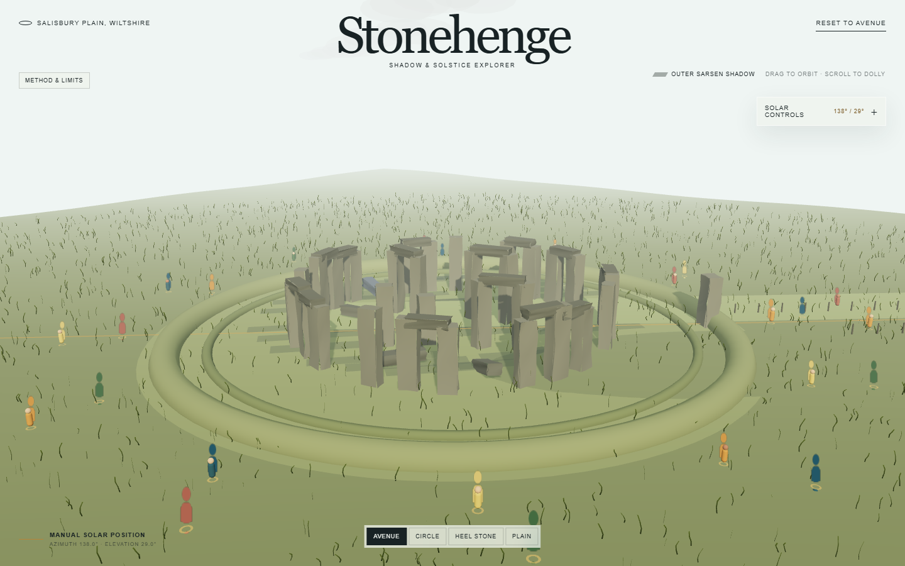
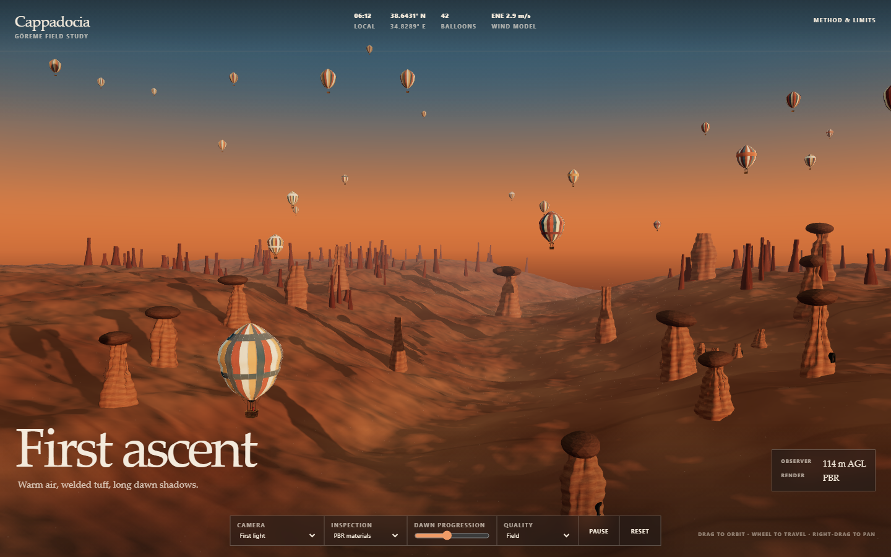

# 3D Prompts Reconstruction

An evidence-grounded reconstruction of the prompt grammar and workflows behind Peter Gostev's interactive 3D demonstrations in [“GPT-6-Astra | First impressions”](https://www.youtube.com/watch?v=GQPi39sjNhU).

> **Model provenance:** the reconstructed prompts are intended to test the GPT-6 Astra behavior shown in Peter's video. The two runnable prototypes in this repository were created by GPT-5.6-family coding models, not GPT-6. They are evaluation artifacts, not claims about GPT-6 output quality.

[Open the GitHub Pages portal](https://az9713.github.io/3d-prompts-reconstruction/)

## Live projects

### Stonehenge — Shadow & Solstice Explorer

[](https://az9713.github.io/3d-prompts-reconstruction/stonehenge/)

[Launch Stonehenge](https://az9713.github.io/3d-prompts-reconstruction/stonehenge/) · [Source](projects/stonehenge/) · [Prompt](projects/stonehenge/PROMPT.txt)

### Cappadocia — First Ascent

[](https://az9713.github.io/3d-prompts-reconstruction/cappadocia/)

[Launch Cappadocia](https://az9713.github.io/3d-prompts-reconstruction/cappadocia/) · [Source](projects/cappadocia/) · [Initial prompt](projects/cappadocia/PROMPT.txt) · [Revised prompt](projects/cappadocia/PROMPT2.txt)

GitHub strips executable iframes and JavaScript from README files. The images above are therefore rendered previews that link to the actual live WebGL applications. The [Pages portal](https://az9713.github.io/3d-prompts-reconstruction/) embeds both live applications.

## What this repository contains

- [Primary reconstruction report](https://az9713.github.io/3d-prompts-reconstruction/reconstruction/): the complete scene inventory, shared master prompt, individual project prompts and evaluation workflow.
- [Development journey](https://az9713.github.io/3d-prompts-reconstruction/reconstruction/DEVELOPMENT-JOURNEY.html): how the video, narration and public repository were converted into a prompt system, including failures and revisions.
- [Reverse-engineering playbook](https://az9713.github.io/3d-prompts-reconstruction/reconstruction/prompt_reverse_engineering_playbook.html): the reusable method, supported meta-patterns and unknown unknowns.
- [`replication_guide.md`](replication_guide.md): the copyable shared prompt, multi-hour workflows and all 37 project specifications.
- [`projects/stonehenge/`](projects/stonehenge/) and [`projects/cappadocia/`](projects/cappadocia/): complete Vite/Three.js source projects.
- [`docs/`](docs/): prebuilt static assets published by GitHub Pages.

## What “reconstruction” means

The video never displays Peter's exact submitted prompt text. The work therefore treats prompt recovery as an inverse problem:

1. Segment the video into distinct projects and run regimes.
2. Record visible composition, geometry, motion, interaction, cameras, interface and failure modes.
3. Align those observations with Peter's narration.
4. Correlate matching scenes with Peter's public [`3d-prompt-collection`](https://github.com/petergpt/3d-prompt-collection).
5. Separate recurring invariants into a shared master prompt.
6. Express each scene's unique ontology and acceptance criteria as a project delta.
7. Label every result as observed, narrated, repository-correlated or reconstructed.

The public repository was a strong corroborating style corpus and vocabulary source. It was **not** treated as proof of the hidden prompts used in the video.

## Main finding

Peter's recurring pattern is not merely “use Three.js.” The prompts combine:

- an immediately legible first frame;
- a complete world around the hero subject;
- strong editorial art direction;
- independent visible motion systems;
- named explanatory camera views;
- controls with obvious consequences;
- explicit collapse modes and negative constraints;
- instancing, LOD and graceful quality degradation.

The first reconstructed master prompt reproduced that benchmark style, but it over-rewarded procedural breadth and under-specified photorealistic hero fidelity. The Stonehenge and Cappadocia tests exposed that mismatch. The later production revision gives factual/physical correctness and documentary realism higher priority than object count, UI or decorative motion.

## Important limitations

- These are independent reconstructions, not Peter Gostev's verbatim prompts and not an official Arena AI project.
- Peter's video and public prompt repository remain his/their respective owners' material. Raw video and transcript copies are not redistributed here.
- The Stonehenge prototype uses a visitor-site coordinate in its current implementation; the analysis recommends the monument coordinate for a future accuracy pass.
- The demonstrations are artistic/educational visualizations, not survey, archaeological, aviation or navigation tools.
- A physically coherent scene is not automatically photorealistic. Realism also requires sufficient geometry, calibrated materials, lighting, references and often a better asset pipeline.

## Run locally

Both projects require Node.js 20+ and npm.

```powershell
cd projects\stonehenge
npm install
npm run dev
```

```powershell
cd projects\cappadocia
npm install
npm run dev
```

## Repository layout

```text
.
├── README.md
├── index.html
├── DEVELOPMENT-JOURNEY.html
├── prompt_reverse_engineering_playbook.html
├── replication_guide.md
├── projects/
│   ├── stonehenge/
│   └── cappadocia/
└── docs/
    ├── index.html
    ├── stonehenge/
    ├── cappadocia/
    └── reconstruction/
```

## Privacy and publication boundary

The published tree excludes local absolute paths, account identifiers, credentials, raw source video, the full transcript, dependency folders, caches and local runtime logs. The repository contains only source, generated application builds, transformed analysis and the limited images needed to render the reports and previews.

## License and attribution

The original code and analysis in this repository are released under the [MIT License](LICENSE). Third-party names, video material and referenced prompt-corpus content are not relicensed; see the linked original sources and their terms.

