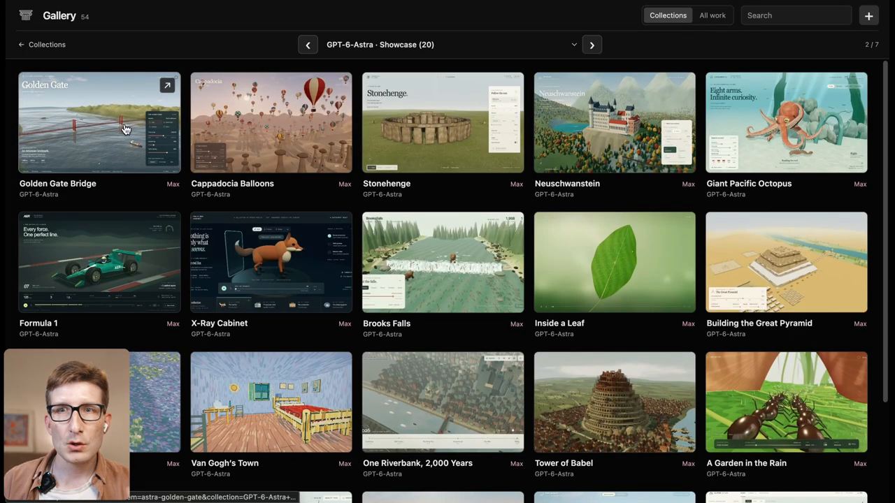
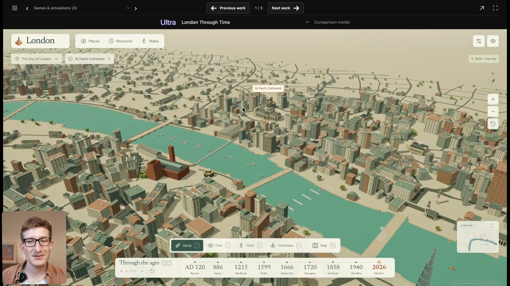
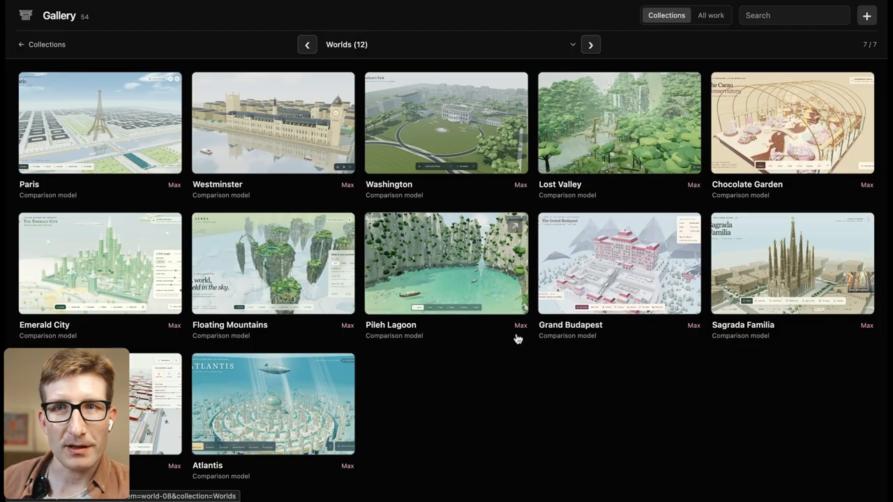

# GPT-6 Astra 3D demos: end-to-end visual reverse engineering

## Executive result

The video contains **36 distinct 3D or interactive projects**, plus one animated peacock SVG study. Three opening projects are explicitly multi-hour, iterative builds. Twenty showcase projects are described as one-shot, Max-reasoning generations taking roughly 20–40 minutes each. Rome and Sagrada Família are then rerun across six reasoning levels. The final “Worlds” collection revisits Sagrada and adds eleven more scenes.

The public `3d-prompt-collection` is highly relevant but is not a transcript of the prompts entered in this video. The video never shows prompt text. Eighteen projects have strong title-and-feature correspondence with repository entries; those are labeled **repo-correlated**. All other prompts below are **reconstructed from the visible result and narration**.

The most reproducible strategy is not to paste 36 unrelated giant prompts. Use the **shared master prompt** once as the invariant “Peter-style compiler,” append a scene-specific delta, and evaluate the result against the visible acceptance checks.



## Evidence and coverage

Sources:

- Arena AI, Peter Gostev, [“GPT-6-Astra | First impressions”](https://www.youtube.com/watch?v=GQPi39sjNhU), 33:49.8, published 2026-09-03.
- Local 1920×1080, 50 fps audiovisual capture: `source_video.mp4`.
- Complete timestamped YouTube transcript: `transcript.txt`.
- Twenty-one contact sheets covering the full runtime at five-second intervals: `evidence_frames/contact_5s_720/`.
- Thirty-eight targeted 1280×720 frames for title, interface, and feature inspection: `evidence_frames/targeted/`.
- Peter Gostev’s [3D Prompt Collection](https://github.com/petergpt/3d-prompt-collection), local checkout at commit `b5b5df94ae9326523d57b70708a81f457e30fac0`.

Coverage vector:

| Dimension | Coverage | Meaning |
|---|---|---|
| Identity | Full | Exact video, creator, duration, and repository resolved. |
| Text/audio | Full | Complete timestamped transcript plus audio in the local capture. |
| Visual | Substantial | Entire runtime sampled every five seconds, with denser targeted inspection around transitions. This is not a claim that every one of the ~101,000 frames was individually inspected. |
| Temporal | Substantial | All chapters and intervening scenes covered; very brief sub-five-second states may be absent. |
| Prompt provenance | Partial | No prompt text appears on screen. Repository correspondence is inferential unless separately documented. |

Evidence labels used below:

- **Observed:** directly visible or spoken in the video.
- **Repo-correlated:** title, concept, controls, and output strongly match a public repository entry, but verbatim use is not proven.
- **Reconstructed:** a new replication prompt inferred from the demonstrated artifact.
- **Unknown:** the video provides insufficient evidence; no detail is invented.

## Complete scene inventory

Times are the demonstrated screen intervals, rounded to the nearest few seconds.

| # | Time | Project | Build class | Prompt evidence |
|---:|---|---|---|---|
| 1 | 00:19–01:38 | London Through Time | Iterative, Ultra | Reconstructed; concept overlaps repo prompt 04 but is a broader nine-era city product. |
| 2 | 01:39–03:24 | D-Day Landings / Omaha Beach | Iterative, Ultra, Blender + Three.js | Reconstructed. |
| 3 | 03:25–05:35 | PALIMPSEST Game Tour / The Fallen Coast | Iterative, approximately overnight | Reconstructed. |
| 4 | 05:36–06:38 | Golden Gate Bridge | One-shot, Max | Repo-correlated: prompt 06. |
| 5 | 06:39–06:51 | Cappadocia Balloons | One-shot, Max | Repo-correlated: prompt 26. |
| 6 | 06:52–07:14 | Stonehenge | One-shot, Max | Repo-correlated: prompt 27. |
| 7 | 07:15–07:59 | Neuschwanstein | One-shot, Max | Reconstructed. |
| 8 | 08:00–08:51 | Giant Pacific Octopus | One-shot, Max | Reconstructed. |
| 9 | 08:52–09:05 | Formula 1 | One-shot, Max | Reconstructed. |
| 10 | 09:06–09:54 | X-Ray Cabinet | One-shot, Max | Reconstructed. |
| 11 | 09:55–10:44 | Brooks Falls | One-shot, Max | Repo-correlated: prompt 59. |
| 12 | 10:45–11:19 | Inside a Leaf | One-shot, Max | Reconstructed. |
| 13 | 11:20–11:57 | Building the Great Pyramid | One-shot, Max | Repo-correlated to prompt 16; prompt 17 is a related finished-Giza alternative. |
| 14 | 11:58–12:55 | Monet’s Water Lilies | One-shot, Max | Repo-correlated: prompt 46. |
| 15 | 12:56–14:47 | Van Gogh’s Town | One-shot, Max | Reconstructed; prompt 45 is a related Starry Night world, not the same multi-painting town. |
| 16 | 14:48–15:42 | One Riverbank, 2,000 Years | One-shot, Max | Repo-correlated: prompt 04. |
| 17 | 15:43–16:29 | Tower of Babel | One-shot, Max | Repo-correlated: prompt 48. |
| 18 | 16:30–17:23 | A Garden in the Rain | One-shot, Max | Repo-correlated: prompt 50. |
| 19 | 17:24–18:22 | Manhattan | One-shot, Max | Repo-correlated: prompt 01. |
| 20 | 18:23–19:16 | Demolition Playground | One-shot, Max | Repo-correlated: prompt 32. |
| 21 | 19:17–20:03 | Istanbul | One-shot, Max | Repo-correlated: prompt 07. |
| 22 | 20:04–20:36 | Humpback Whale | One-shot, Max | Reconstructed. |
| 23 | 20:37–21:27 | Swiss Alpine Trail | One-shot, Max, research-dependent | Reconstructed. |
| 24 | 21:28–23:04 | Peacock / PAVO | Animated SVG, Max | Reconstructed; included as a non-3D appendix. |
| 25 | 23:05–26:59 | Ancient Rome / Colosseum | Six reasoning levels | Repo-correlated to prompt 02; prompt 19 is a related Colosseum-only specification. |
| 26 | 27:00–28:50 | Sagrada Família | Six reasoning levels | Reconstructed. |
| 27 | 28:51–29:06 | Paris | Final Worlds collection, Max | Repo-correlated: prompt 05. |
| 28 | 29:07–29:37 | Westminster | Final Worlds collection, Max | Reconstructed. |
| 29 | 29:38–29:54 | Washington / White House | Final Worlds collection, Max | Reconstructed. |
| 30 | 29:55–30:19 | Lost Valley | Final Worlds collection, Max | Repo-correlated: prompt 13. |
| 31 | 30:20–30:39 | Chocolate Garden / Cacao Conservatory | Final Worlds collection, Max | Repo-correlated: prompt 14. |
| 32 | 30:40–30:44 | Emerald City | Final Worlds collection, Max | Repo-correlated: prompt 12. |
| 33 | 30:45–30:49 | Floating Mountains | Final Worlds collection, Max | Reconstructed; repo prompt 30 is a related Zhangjiajie glide, not a proven match. |
| 34 | 30:50–31:14 | Pileh Lagoon | Final Worlds collection, Max | Repo-correlated: prompt 10. |
| 35 | 31:15–31:34 | Grand Budapest | Final Worlds collection, Max | Repo-correlated: prompt 15. |
| 36 | 31:40–32:04 | Forbidden City | Final Worlds collection, Max | Repo-correlated: prompt 09. |
| 37 | 32:05–32:29 | Atlantis | Final Worlds collection, Max | Repo-correlated: prompt 11. |

The video returns to D-Day during the closing argument at 32:35–33:19; that is a recap, not a new project.

## What Peter’s style actually is

The output style is not simply “low-poly Three.js.” It is a coupled system with eight recurring properties:

1. **One immediately legible spectacle.** The first frame explains the entire premise before the user touches anything.
2. **A complete world, not a hero prop.** Context extends to the horizon: terrain, water, supporting architecture, crowds, traffic, vegetation, atmospheric layers, and scale cues.
3. **Editorial art direction.** Warm off-whites, restrained greens and terracottas, large serif headlines, tiny uppercase metadata, generous whitespace, and one accent color. Dark themes are used when the subject demands it, as in X-Ray Cabinet and PAVO.
4. **Stylized geometry with selective detail.** Most scenes are procedural, low-poly or voxel-like. Fidelity comes from density, silhouette, composition, and coordinated systems rather than photoreal texture maps.
5. **A designed camera journey.** Wide hero view, orbit/pan/zoom, named presets, and at least one intimate or impossible vantage.
6. **Visible dynamism.** Boats, traffic, clouds, crowds, animals, particles, water, fire, construction, or transitions move from the first seconds. Peter’s repeated criticism is that Astra’s motion is sometimes less convincing than its static composition.
7. **Controls that change the world.** Time, weather, era, intensity, population, camera, or simulation state—not decorative sliders.
8. **Performance-aware ambition.** Instancing, pooled particles, merged geometry, LOD, capped pixel ratio, and quality degradation that preserves the central silhouette.



The transferable insight is to treat prompt design as **specification compilation**: global art direction + scene ontology + motion systems + interaction contract + performance contract + acceptance tests. A vague request for “a beautiful 3D scene” leaves the model to optimize the wrong objective.

## Shared master prompt

Append exactly one project delta from the later sections to this master prompt. This is a reconstruction of Peter’s recurring prompt grammar, not a quotation.

```text
Build a maximum-ambition interactive Three.js web experience for the PROJECT DELTA below. Deliver the complete runnable implementation, not a plan, mockup, static image, or partial scaffold.

FIRST FRAME
Open directly on the defining spectacle. A viewer must understand the premise, scale, place, and emotional tone in one glance. No splash screen, empty loading state, title-only reveal, generic dark background, or isolated hero object. Compose foreground, midground, background, atmosphere, and human-scale cues deliberately.

WORLD AND MATERIAL LANGUAGE
Create a complete spatial world extending beyond the central subject. Prefer procedural geometry, instancing, merged modules, generated textures, restrained stylization, and strong silhouettes. Use an editorial visual system: large refined serif display type, quiet sans-serif metadata, warm off-white or subject-appropriate dark surfaces, one controlled accent color, generous whitespace, compact translucent controls, and no generic dashboard chrome. Match the project delta’s explicit palette and material cues.

MOTION
The scene must already be alive. Implement at least three independent visible systems appropriate to the subject—examples include water, clouds, crowds, traffic, creatures, particles, fire, vegetation, machinery, or time transitions. Motion must have varied phase, speed, and paths; avoid synchronized toy-like oscillation.

PHYSICS — NON-NEGOTIABLE
Laws of physics must be obeyed. Gravity, structural support, contact, collisions, trajectories, scale, illumination, shadows, and material responses must remain physically coherent. Stylization may simplify appearance, but it must not permit unsupported floating geometry, unexplained interpenetration, impossible motion, or effects without plausible causes. When a full simulation is impractical, implement a conservative physically plausible approximation and disclose the approximation instead of presenting impossible behavior as accurate.

EXPLORATION
Provide orbit/pan/zoom or first-person controls as appropriate, tuned with light inertia. Include Reset and 3–5 named camera presets. Add only 2–5 compact controls, each causing an obvious visual state change. The primary scene remains unobstructed on a laptop and usable on a narrow viewport.

TECHNICAL CONTRACT
Use a minimal Vite project or a single HTML module. If using import maps, map "three" and "three/addons/" to the same pinned version before the module script. Use descriptive block-scoped identifiers; avoid duplicate declarations and global leakage. Clamp devicePixelRatio to 2. Use InstancedMesh for repeated geometry, pooled particles, merged static geometry, frustum culling, and at least two LOD tiers where scale requires it. Dispose regenerated resources. Provide a quality selector that removes distant density and expensive reflections before damaging the hero silhouette. Avoid external models and images unless the delta explicitly authorizes them.

ACCEPTANCE TESTS
1. The first frame communicates the entire idea without explanation.
2. The nearest subject survives close inspection while the wide view remains coherent.
3. At least three motion systems are visible simultaneously.
4. Every control produces a clear and reversible change.
5. Reset always restores the authored hero composition.
6. No console errors, blank canvas, camera clipping, z-fighting, or severe frame stalls.
7. The implementation runs locally with documented commands.

PROJECT DELTA:
[PASTE ONE DELTA HERE]
```

## Multi-hour build workflows

The first three artifacts should not be treated as one-shot prompts. Peter explicitly says London required several generations, D-Day required many hours, and the open-world game ran for hours or overnight.

### 1. London Through Time

Observed visual contract: a complete low-poly London and Thames; nine selectable eras—AD 120 Roman, 886 Saxon, 1215 Medieval, 1599 Tudor, 1666 Great Fire, 1720 Georgian, 1858 Victorian, 1940 Blitz, 2026 Modern; Aerial, First, Third, Overhead and map views; named places, moments, and walks; editorial cream-and-green UI. An OpenStreetMap attribution is visible, so the demonstrated build appears to use OSM-derived geographic data rather than being wholly procedural.

Initial build prompt:

```text
Create “London Through Time,” an explorable Three.js historical city atlas centered on the Thames. Preserve one coordinate system and recognizable river geometry while the entire city transforms across nine eras: Roman AD 120, Saxon 886, Medieval 1215, Tudor 1599, Great Fire 1666, Georgian 1720, Victorian 1858, Blitz 1940, and Modern 2026. Use a warm cream map aesthetic, turquoise water, muted brick/stone/green palettes, editorial serif typography, and compact museum-quality controls. Include named places, curated historical moments, guided walks, Aerial/First/Third/Overhead cameras, a minimap, and a bottom time rail. Every era must be a complete world with era-specific street density, landmark silhouettes, clothing/crowd proxies, boats, smoke, traffic, and ambient motion. Transitions should preserve the camera and morph or cross-fade spatially corresponding districts rather than hard-cutting unrelated dioramas.
```

Recommended workflow:

1. Define a canonical geographic graph: Thames spline, bridge anchors, landmark coordinates, road hierarchy, district polygons, and camera presets. Record the OSM license and preserve attribution if OSM data is used.
2. Build one modern “truth” scene and validate navigation, map alignment, LOD, and performance.
3. Represent each era as a data layer—building archetypes, road coverage, bridges, landmarks, vegetation, transport, population, and atmosphere—not as eight copied applications.
4. Implement two adjacent eras first and prove the transition architecture before authoring all nine.
5. Add first/third-person modes only after world streaming is stable.
6. Run historical review separately. The video itself does not establish historical accuracy.
7. Finish with the editorial UI, named moments, guided walks, and a visual regression set containing the same hero camera in all eras.

### 2. D-Day Landings / Omaha Beach

Observed visual contract: a desaturated, overcast Omaha Beach; animated soldiers moving inland; landing craft and ships; Czech hedgehogs and beach obstacles; smoke and shell impacts; tanks and trucks; a phase timeline; black editorial overlay. Peter explicitly states that assets were designed in Blender and then composed into a Three.js environment.

Initial orchestration prompt:

```text
Build an historically grounded, non-glamorizing interactive reconstruction of the Omaha Beach landings using a Blender-to-glTF asset pipeline and a Three.js runtime. The opening composition is a wide, cold, overcast beach under fire: surf and landing craft behind, layered infantry movement through obstacles in the midground, smoke and defended bluffs ahead. Organize the experience as a timeline with named phases such as approach, coast under fire, support from sea, inland pressure, and aftermath. Use desaturated sand, steel, olive drab, fog, wind-driven spray, restrained typography, and documentary pacing. The objective is scale, uncertainty, and coordinated motion, not an arcade shooter.
```

Recommended workflow:

1. Create an asset bible before modeling: soldier silhouettes, landing craft, tank/truck families, obstacles, bunkers, weapons, debris, and LOD budgets.
2. Ask the coding agent to generate Blender Python scripts for modular assets. Export named glTF/GLB files with consistent meters, origins, material slots, collision proxies, and animation clips.
3. In Three.js, build terrain, surf, sky, fog, smoke, shell impacts, and a navmesh/flow field independently of the hero assets.
4. Drive infantry by lane-based flow fields with per-agent phase offsets, hesitation, falls, cover-seeking, and local avoidance. Do not hand-author thousands of paths.
5. Stage timeline phases by parameter changes—spawn rates, visibility, smoke, vessel positions, artillery, inland progress—not by loading separate pages.
6. Add authored camera presets: landing craft, waterline, infantry shoulder, bluff defense, tank approach, and high overview.
7. Profile draw calls, skinned meshes, and particles. Crowd diversity should come from animation offsets, equipment variants, and color/material variation.
8. Validate military facts with specialist sources before calling the result accurate; Peter explicitly says he is not an expert.

### 3. PALIMPSEST Game Tour / The Fallen Coast

Observed visual contract: a first-person open world with a stylized white-and-gold hand/device, large grassy terrain, coastline and water, trees, enemy encounters, jumping, ranged interaction, voice/audio, objectives, named regions, a companion or quest interface, and a polished dark editorial menu. The title and geography visible in the video include “The Fallen Coast,” “The Reasoning Wilds,” and “The Tomorrow Meridian.” Peter asked for approximately ten hours of gameplay but explicitly says he did not verify ten hours.

Initial orchestration prompt:

```text
Create “PALIMPSEST,” a first-person exploration game set across a seamless fallen coastal world where abandoned scientific monuments and impossible geometric ruins emerge from grasslands, beaches, hills, and shallow seas. The player carries a white-and-gold field instrument that scans, interacts, and fires controlled pulses. Build three visually distinct regions—The Fallen Coast, The Reasoning Wilds, and The Tomorrow Meridian—connected by traversal, environmental puzzles, roaming enemies, short voiced encounters, and a quest chain that changes the landscape. Use restrained diegetic HUD elements, poetic editorial typography, pale skies, green-gold terrain, black/cream menus, and monumental low-poly forms. Prioritize satisfying locomotion, exploration loops, and a coherent two-hour vertical slice; architect content data so it can expand toward ten hours without pretending untested duration.
```

Recommended workflow:

1. Build a 15-minute vertical slice: locomotion, jump, combat pulse, one enemy, one scan puzzle, one voiced encounter, save/load, and one region transition.
2. Separate engine systems from content tables. Regions, encounters, loot, dialogue, and quests should be authored as data.
3. Use terrain chunks, deterministic seeds, navmesh tiles, pooled enemies/projectiles, and distance-based simulation.
4. Generate a content matrix before scaling: traversal verbs × enemy families × puzzle families × environmental states × narrative beats.
5. Add audio only after interaction timings stabilize. Use subtitles and gain controls.
6. Instrument playtime and completion paths. “Ten hours” is a measured content property, not a prompt adjective.

## One-shot prompt deltas

Peter says these twenty projects were one-shot Max generations, generally taking about 20–40 minutes. To reproduce that experiment, append one delta to the shared master prompt and do not send correction prompts until the run is archived. For a production result, use the evaluation loop later in this guide.

### 4. Golden Gate Bridge

**Repo-correlated:** [prompt 06](https://github.com/petergpt/3d-prompt-collection#prompt-06).

```text
Create a realistic, explorable Golden Gate Bridge spanning the full bay between the Presidio and Marin Headlands. Compose the entire red suspension structure, traffic, moving boats, wind-textured water, San Francisco distance silhouettes, headland terrain, clouds, and a height-based fog bank that gathers below and around the deck rather than becoming a flat global haze. Controls: coherent fog-bank height/density, traffic, sea state, time of day, weather, and named bridge/deck/aerial/waterline cameras. Preserve accurate bridge proportions and cable rhythm; never reduce it to two red towers in generic water.
```

### 5. Cappadocia Balloons

**Repo-correlated:** [prompt 26](https://github.com/petergpt/3d-prompt-collection#prompt-26).

```text
Create Cappadocia at 06:10 sunrise: 80–100 patterned hot-air balloons moving at varied altitudes among Göreme’s warm sandstone valleys, fairy chimneys, cap rocks, and visible cave dwellings. Use long dawn shadows, airborne dust, subtle haze, tiny ground crews, and a restrained travel-editorial UI showing coordinates, time, balloon count, wind direction, flight speed, and morning-light controls. The hero camera floats among balloons; presets include valley floor, basket-height drift, high fleet view, and close pass. Avoid random cones on flat sand or identical synchronized balloons.
```

### 6. Stonehenge

**Repo-correlated:** [prompt 27](https://github.com/petergpt/3d-prompt-collection#prompt-27).

```text
Create an accurate Stonehenge shadow-and-solstice explorer on Salisbury Plain. Model orthostats, lintels, irregular weathering, fallen stones, earthwork rings, the Avenue, distant fencing and visitors, and a grass field with directional wind. Open on the complete monument under pale daylight. Controls expose sun azimuth, elevation, midsummer/winter presets, grass wind, visitors, and an alignment guide; show the computed outer sarsen shadow. Orbit/dolly and reset to the Avenue. Do not reconstruct a perfectly complete circular wall when the current monument is selected.
```

### 7. Neuschwanstein

**Reconstructed.**

```text
Create “Neuschwanstein — A dream above the forest,” a refined low-poly Bavarian landscape with the recognizable white castle, dark slate towers, red roofs, limestone crag, Alpsee lake, autumn forest, valley, and layered Alps. Use airy blue-gold light and travel-editorial typography. Controls choose Summer/Autumn/Mist, time from first light to blue hour, and four cameras: Marienbrücke hero, valley approach, aerial orbit, and castle terrace. Bridges and paths must connect physically to terrain—no floating bridge. Use dense instanced forest color variation and mountain LOD.
```

### 8. Giant Pacific Octopus

**Reconstructed.**

```text
Create a bright “living study” of a giant Pacific octopus in a shallow kelp-and-rock habitat, styled as a natural-history editorial microsite. The octopus must have a convincing mantle, eight independently articulated arms, underside suckers, eye tracking, color mottling, and exploratory behaviors around rocks, shells, fish, and kelp. Offer Den, Eye-to-eye, Sucker study, and Above cameras; controls vary arm activity, temperament, depth, current, and living color. Motion must use different phase and reach targets per arm, with body propulsion and substrate contact—not one synchronized wiggle.
```

### 9. Formula 1

**Reconstructed.**

```text
Build an interactive Formula 1 aerodynamics and telemetry study around a detailed modern open-wheel car in deep green. Present the vehicle on a dark wind-tunnel stage with a restrained technical/editorial interface. Animate wheel spin, suspension response, steering, airflow ribbons, brake glow, DRS, and ride-height change. Controls switch fast approach/progressive braking/cornering states and expose speed, gear, throttle, brake, downforce balance, steering angle, and camera presets. Preserve correct open-wheel proportions, front/rear wings, halo, floor, and diffuser; avoid a generic sports car.
```

### 10. X-Ray Cabinet

**Reconstructed.**

```text
Create “The X-Ray Cabinet,” a dark museum instrument that moves a scanning boundary through four charming objects—a red fox, pocket radio, weekend suitcase, and sleeping geode—and reveals coherent internal worlds. The fox transitions from exterior to skeleton and soft organs; the radio exposes circuitry and speaker; the suitcase reveals packed contents; the geode reveals crystalline layers. Use a teal-black editorial UI, specimen labels, orbit/position/rotate modes, a draggable scan plane, three spectra, annotated discoveries, and smooth cross-section clipping. Internal and external geometry must stay registered during the transition.
```

### 11. Brooks Falls

**Repo-correlated:** [prompt 59](https://github.com/petergpt/3d-prompt-collection#prompt-59).

```text
Create Brooks Falls, Alaska, at peak salmon run: a wide whitewater lip filled with continuous varied salmon arcs and several brown bears using distinct fishing behaviors. Add hundreds of fish in the pool, spray, river current, spruce banks, rocks, gulls, and distant watchers. Open mid-action. Controls change run intensity, catch frequency, current, and classic/bank/pool/above cameras; show live leaps-per-minute and catches. Most fish should fail believably; bears must feel heavy and unsynchronized.
```

### 12. Inside a Leaf

**Reconstructed.**

```text
Create “Inside a Leaf,” a continuous scientific zoom journey from an intact sunlit leaf through vein network, epidermis, stomata, mesophyll, chloroplasts, thylakoid stacks, photosynthetic complexes, and molecular scale. Use a luminous green biological-atlas aesthetic, a ten-stage bottom scale rail, sparse labels, and smooth camera handoffs so spatial relationships remain understandable. Animate stomatal opening, gas particles, water transport, chloroplast drift, photon arrival, and molecular activity. Label uncertainty and keep scales explicit; scientific legibility matters more than decorative fantasy.
```

### 13. Building the Great Pyramid

**Repo-correlated:** [prompt 16](https://github.com/petergpt/3d-prompt-collection#prompt-16), with [prompt 17](https://github.com/petergpt/3d-prompt-collection#prompt-17) as a finished-Giza alternative.

```text
Create a time-scrubbable Great Pyramid construction world around 2560 BCE. Show the Nile and harbor, quarry/stone logistics, causeway, ramps and scaffolds, rope teams, sledges, oxen, workshops, surveyors, workers, Sphinx, satellite monuments, desert and cultivated strips. A build-progress slider must visibly grow the pyramid from foundations through casing and capstone while workforce and sunlight controls change activity and composition. Use warm sand, pale limestone, compact archaeological UI, and wide/ground/ramp/river cameras. Do not present one static finished ruin.
```

### 14. Monet’s Water Lilies

**Repo-correlated:** [prompt 46](https://github.com/petergpt/3d-prompt-collection#prompt-46).

```text
Create a navigable Giverny pond in which every surface is made from thick, floating Impressionist color dabs rather than realistic textures. Drift at water level through lilies, willow curtains, the arched bridge, gardens, reflections, and a painted sky. Light states move from silver morning through pink sunset to blue evening and recompose the palette. Controls choose light series, drift, steering, paint-finness, and quality. Geometry should read as brush marks at every scale; avoid a normal pond with a post-processing filter.
```

### 15. Van Gogh’s Town

**Reconstructed.**

```text
Build a continuous walkable world connecting several recognizable Van Gogh paintings as adjacent places: The Bedroom in Arles, the Yellow House and café street at night, a starry blue town, wheat fields, cypresses, and an engulfing sunflower garden. Everything—walls, ground, sky, furniture, people, stars, plants—must be constructed from dimensional impasto strokes and Van Gogh’s yellow/ultramarine/green palette. Use first-person movement with seamless doors and paths between paintings; animate sky strokes, lamplight, wheat, cypresses, and birds. Preserve each painting’s characteristic composition while making the transitions spatially coherent.
```

### 16. One Riverbank, 2,000 Years

**Repo-correlated:** [prompt 04](https://github.com/petergpt/3d-prompt-collection#prompt-04).

```text
Fix one camera over the Thames and transform the same riverbank continuously across Roman, Medieval, Great Fire, Georgian, Victorian, Blitz, and modern London. Every slider stop is a complete moving world, not a sparse comparison model. Preserve river and landmark anchors while bridges, roofs, streets, vessels, industry, population, fire, searchlights, traffic, and skyline change. Use a quiet cream historical-atlas UI with a bottom timeline, camera presets, and animated transition choreography.
```

### 17. Tower of Babel

**Repo-correlated:** [prompt 48](https://github.com/petergpt/3d-prompt-collection#prompt-48).

```text
Create Bruegel’s Tower of Babel as a colossal living construction site and complete sixteenth-century port city. Match the painting’s spiraling, part-finished architecture, red roofs, arched galleries, ramps, cranes, crowds, quays, ships, countryside, and cloud-wrapped summit. Thousands of workers should haul, carve, climb, and operate machinery with varied phase. Controls choose painting/king’s inspection/port/summit views, afternoon light, population activity, cloud height, and quality. Avoid a smooth fantasy ziggurat or empty monumental model.
```

### 18. A Garden in the Rain

**Repo-correlated:** [prompt 50](https://github.com/petergpt/3d-prompt-collection#prompt-50).

```text
Place the viewer one millimeter tall on a leaf during a bright rainstorm. Grass becomes a forest; raindrops become transparent boulders that impact as crowns, roll, merge, refract the upside-down garden, and bend leaves. Add ants sheltering under a petal, a bee passing like an aircraft, mushrooms, pollen, insects, wind, and puddle flow. Controls scrub storm phase, drop scale/rate, wind, slow motion, and ant/leaf/ground cameras. Water material and impact behavior are the hero; do not make a generic macro garden.
```

### 19. Manhattan

**Repo-correlated:** [prompt 01](https://github.com/petergpt/3d-prompt-collection#prompt-01).

```text
Create the complete island of Manhattan from Battery to Inwood as one continuous explorable procedural object at golden hour. Preserve the island outline, rotated grids, Broadway, Central Park, district height patterns, landmark silhouettes, bridges, rivers, boats, traffic, water towers, roofs, and close-range street detail. The camera must dive seamlessly from a whole-island hero view to street scale with staged LOD. Controls provide full island, harbor, Midtown, Central Park, bridge, and uptown views plus light and activity. Never substitute a generic rectangular city.
```

### 20. Demolition Playground

**Repo-correlated:** [prompt 32](https://github.com/petergpt/3d-prompt-collection#prompt-32).

```text
Build a sunlit downtown block designed for reversible destruction. The player controls a crane-mounted wrecking ball, places charges, triggers chain collapses, slows time, and rewinds every piece to the pristine city. Buildings need structural layers, breakable facade/floor modules, dust and debris pooling, weighty cable physics, scoring by mass demolished, and a 60-second memory timeline. Use a clean civic-editorial UI and overview/ball/ground/cinematic cameras. Destruction physics—not decorative explosions—is the core system.
```

### 21. Istanbul

**Repo-correlated:** [prompt 07](https://github.com/petergpt/3d-prompt-collection#prompt-07).

```text
Create Istanbul’s historic peninsula and Golden Horn at golden hour: Hagia Sophia, Blue Mosque, minarets, Galata side, Galata Bridge, dense layered roofs, ferries, fishing and tour boats, wakes, gulls, traffic, waterfront activity, and distant Bosphorus bridges. Open on a museum-quality full panorama with glittering turquoise water and warm haze. Provide monument, bridge, ferry, skyline, and aerial cameras plus time/activity controls. Ships must follow nonintersecting channels; avoid a generic mosque skyline.
```

### 22. Humpback Whale

**Reconstructed.**

```text
Create “The Great Ascent,” a bright natural-history study of a humpback whale breaching through a calm blue ocean. The same whale must remain coherent above and below the surface, with believable body arc, fins, droplets, splash crown, foam ring, bubbles, schools of fish, caustics, and a smooth surface cross-section. Controls switch above/beneath views and vary breach frequency, splash volume, underwater visibility, light angle, and playback. Use pale aqua editorial typography and a few named cameras. Motion must convey mass and momentum rather than a slow rigid rotation.
```

### 23. Swiss Alpine Trail

**Reconstructed; research-dependent.**

```text
Research and build a premium interactive 3D trail guide for a real Swiss Alpine route above the Aletsch Glacier. Use verified terrain/elevation data, a shaded relief model, glacier geometry, trail line, huts, passes, viewpoints, hazard areas, distance and elevation profile, stage breakdown, weather/season context, and labeled POIs. The default page combines an editorial left rail—distance, ascent, grade, estimated time—with a large manipulable terrain model and synchronized elevation scrubber. Every geographic label and metric must cite its source; never invent a plausible mountain route.
```

### 24. Peacock / PAVO animated SVG

**Reconstructed; not a 3D demo.**

```text
Create the most intricate self-contained animated SVG you can: an Indian peafowl in a dark museum study, with a 193-feather fully fanned train, iridescent eye spots, fine barb geometry, layered body plumage, head tracking, breathing, individual feather sway, staged unfurl/refurl animation, three lighting palettes, zoom/download controls, and restrained natural-history typography. Use reusable SVG symbols, gradients, masks, filters, and transform groups; maintain coherent anatomy and smooth performance rather than merely maximizing path count.
```

## Reasoning-level experiments

### 25. Ancient Rome / Colosseum

**Repo-correlated:** [prompt 02](https://github.com/petergpt/3d-prompt-collection#prompt-02); [prompt 19](https://github.com/petergpt/3d-prompt-collection#prompt-19) is a more focused alternative.

```text
Create a high-definition voxel-art simulation of ancient Rome centered on a detailed Colosseum. Build a solid isometric city tile with the Colosseum cavea and hypogeum, Forum and basilicas, temples, Circus Maximus, aqueduct, dense insulae, roads, Tiber edge, hills, cypress/pine vegetation, crowds, and warm Mediterranean light. Use collision-aware zoning, instanced voxels, responsive orbit/zoom, recenter, flyover, day/sunset, labels, and compact editorial controls. No overlapping buildings, hollow ground, sparse museum diorama, or isolated arena.
```

Run the exact same prompt once at Low, Medium, High, Extra High, Max, and Ultra. Archive code, token use, wall time, screenshot, console log, and measured geometry/draw-call counts for each. The video shows a clear richness increase from Low to Medium/High, but not a monotonic aesthetic improvement: Max has less harmonious color in one run, and Peter judges Ultra not obviously better than Max. Because seed and sampling variation are uncontrolled, this is illustrative rather than a clean causal experiment.

### 26. Sagrada Família

**Reconstructed.**

```text
Create a complete, explorable low-poly Barcelona centered on an architecturally recognizable Sagrada Família. Model the Nativity/Passion massing, clustered towers with colored pinnacles, portals, branching interior columns, stained glass, nave, surrounding Eixample grid, streets, trees, visitors, and changing Mediterranean light. Open on a clean aerial hero composition; include facade, nave, tower, city, and high-orbit cameras with light/time and crowd controls. Use cream stone, restrained pastel city blocks, jewel stained glass, editorial typography, and progressive LOD. Avoid generic Gothic spires or a church isolated on an empty plane.
```

Use the same six-level measurement protocol as Rome. Judge more than screenshot richness: landmark proportion, navigable interior, camera quality, UI obstruction, runtime, draw calls, and whether additional reasoning produced useful systems rather than decorative geometry.

## Final Worlds gallery

The final collection contains twelve titled worlds. Sagrada is already specified above; the remaining eleven deltas follow.



### 27. Paris

**Repo-correlated:** [prompt 05](https://github.com/petergpt/3d-prompt-collection#prompt-05).

```text
Create a complete museum-quality Paris vista centered on the Eiffel Tower: precise tower silhouette and lattice impression, Champ de Mars, Trocadéro, Seine, bridges, fountains, avenues, cream rooftops, trees, boats, traffic, visitors, and changing light. The first frame is a bright axial postcard with true urban scale; exploration must reward both close tower inspection and a city-wide view. Use instancing and LOD rather than an isolated tower in a blank grid.
```

### 28. Westminster

**Reconstructed.**

```text
Create a complete Westminster riverfront in pale daylight: Palace of Westminster with correct Thames orientation, Elizabeth Tower clock faces, Victoria Tower, Westminster Hall massing, Westminster Bridge, London Eye, embankments, boats, buses, traffic, pedestrians, and water reflections. Provide river, bridge, aerial, clock-tower, and courtyard views. Preserve relative placement and orientation—the video’s generated church/complex orientation is acknowledged as imperfect.
```

### 29. Washington / White House

**Reconstructed.**

```text
Create “President’s Park,” a complete bright low-poly White House environment: north and south facades, curved South Portico, wings, lawns, Ellipse, paths, fountains, gardens, fences, security perimeter, mature trees, nearby federal-city massing, pedestrians and subtle service activity. Use an aerial civic-atlas composition with North Lawn, South Lawn, Ellipse, ground, and orbit cameras. Avoid a lone mansion on a green rectangle.
```

### 30. Lost Valley

**Repo-correlated:** [prompt 13](https://github.com/petergpt/3d-prompt-collection#prompt-13).

```text
Create a vast protected dinosaur sanctuary as living wildlife: emerald river basin, dense layered jungle, waterfalls, cliffs and mist, with a long-neck herd crossing shallow water, smaller herbivores among ferns, predators at distance, and pterosaurs in sun shafts. Use varied autonomous behaviors and ecological spacing, not museum poses. Open on a high overlook, then allow river-level, herd-follow, canopy, waterfall, and night cameras.
```

### 31. Chocolate Garden / Cacao Conservatory

**Repo-correlated:** [prompt 14](https://github.com/petergpt/3d-prompt-collection#prompt-14).

```text
Create an original edible valley inside a monumental glass-roofed confectionery works: chocolate river, candy orchards, biscuit bridges, caramel falls, pastel sweets, copper vats, pipes, galleries, delivery systems, turning machinery, and tiny workers. Compose the bright cream/cocoa/pink world like a luxury conservatory brand rather than a dark factory. Include garden, river, machine, overhead cutaway, and production-flow cameras with sweetness/material/activity controls.
```

### 32. Emerald City

**Repo-correlated:** [prompt 12](https://github.com/petergpt/3d-prompt-collection#prompt-12).

```text
Create the Emerald City at the end of the Yellow Brick Road as a complete luminous destination: green crystal towers, art-deco spires, gates, gardens, fountains, markets, citizens, surrounding fields, and the gold road arriving in the foreground. Use bright mint, emerald, cream, and gold with airy storybook-editorial UI. Provide arrival, gate, market, tower, and aerial cameras and controls for crystal glow, activity, and weather.
```

### 33. Floating Mountains

**Reconstructed; repo prompt 30 is only a related reference.**

```text
Create a serene airborne archipelago of enormous vertical stone islands floating above a white cloud sea. Each island has eroded cliffs, hanging roots, waterfalls disappearing into mist, dense green crowns, bridges, birds, drifting seed particles, and smaller rocks orbiting at varied depths. The camera glides freely between islands with near-collision avoidance; controls vary mist height, wind, waterfall flow, island spacing, and sunrise/storm light. Ensure strong parallax and scale—never arrange identical rocks in one plane.
```

### 34. Pileh Lagoon

**Repo-correlated:** [prompt 10](https://github.com/petergpt/3d-prompt-collection#prompt-10).

```text
Create the complete Pileh Lagoon at Phi Phi Leh: radiant turquoise water enclosed by towering jungle-covered limestone walls, long-tail boats, swimmers, kayaks, reef shallows, fish, birds, cliffs, hidden ledges, and a visible sea opening. Open on an elevated paradise composition and support waterline, boat, cliff, underwater, and full-lagoon views. Prioritize water depth/color, karst scale, moving boats with wakes, and dense irregular vegetation.
```

### 35. Grand Budapest

**Repo-correlated:** [prompt 15](https://github.com/petergpt/3d-prompt-collection#prompt-15).

```text
Create a complete alpine resort inspired by the Grand Budapest at its peak: towering symmetrical pink hotel, funicular and stations, forecourt, terraces, snowy mountains, village, period cars, arriving guests, lobby and dining glimpses, service routes, and coordinated staff activity. Use centered storybook compositions, pink/red/cream palette, pristine snow, and diorama-like low-poly geometry. Cameras cover facade, funicular, lobby, service, village, and alpine overview.
```

### 36. Forbidden City

**Repo-correlated:** [prompt 09](https://github.com/petergpt/3d-prompt-collection#prompt-09).

```text
Create Beijing’s Forbidden City during the first clear snowfall: the entire axial palace world of vermilion walls, golden roofs under fresh snow, white marble terraces, gates, courtyards, bridges, gardens, lantern warmth, layered horizons, sparse attendants, and drifting flakes. Use immense ordered symmetry and bright winter haze. Cameras should traverse the central axis, courtyard level, roofline, garden, and full aerial view without collapsing the complex to one generic temple.
```

### 37. Atlantis

**Repo-correlated:** [prompt 11](https://github.com/petergpt/3d-prompt-collection#prompt-11).

```text
Create Atlantis as a living underwater capital, not ruins: immense concentric boulevards and canals, luminous domes, pale gold towers, coral gardens, protected plazas, citizens, schools of fish, transit, sunbeams, and a colossal whale passing above for scale. Open on the full circular city in clear cyan water. Provide capital, canal, dome, street, whale, and surface-looking-down views with current, light, population, and whale-path controls.
```

## Execution and evaluation workflow

### Reproduce the benchmark faithfully

1. Start each one-shot in a clean folder and a new agent context.
2. Paste the shared master prompt plus exactly one delta.
3. Use Max reasoning for the main showcase set. Record model build, reasoning level, date, wall time, and token usage.
4. Allow the agent to implement and run its own checks. Do not add taste corrections during the benchmark run.
5. Archive the first runnable output, full conversation, file tree, console log, and a fixed set of screenshots before changing anything.
6. For Rome and Sagrada, rerun the identical prompt at all six reasoning levels; do not silently repair failed levels.

### Turn a benchmark output into a production result

Use short, evidence-driven correction passes instead of another giant prompt:

```text
Audit the running experience against the acceptance tests in the original specification. Do not redesign it yet. Return a table of observed failures with screenshot/state evidence, severity, likely root cause, and the smallest coherent fix. Separate visual composition, geometry, motion, interaction, factual accuracy, and performance.
```

Then fix one failure class per turn:

1. **Composition pass:** camera, scale, foreground/midground/background, empty areas, silhouette.
2. **World pass:** missing context, density, landmarks, material variation, spatial coherence.
3. **Motion pass:** phase variation, path realism, contacts, acceleration, response to controls.
4. **Interaction pass:** meaningful controls, reset, presets, input conflicts, accessibility.
5. **Performance pass:** draw calls, shader cost, particle pools, LOD, memory disposal, DPR.
6. **Accuracy pass:** validate geography, biology, physics, or history with authoritative sources.

### A stronger evaluation rubric

Score each 0–5:

| Dimension | Test |
|---|---|
| First-frame premise | Can a new viewer name the experience in three seconds? |
| Composition | Is there a deliberate foreground, middle, background, and scale cue? |
| World completeness | Does the environment continue coherently beyond the hero object? |
| Landmark/subject fidelity | Are silhouette, placement, proportions, and essential features recognizable? |
| Motion quality | Are multiple systems varied, weighty, and causally plausible? |
| Interaction consequence | Does every control produce a visible, reversible world change? |
| Camera design | Do presets reveal distinct information without clipping or disorientation? |
| UI taste | Is the interface restrained, legible, subject-specific, and non-obstructive? |
| Runtime integrity | No blank states, console errors, broken imports, or runaway memory. |
| Performance | Smooth target hardware behavior with measured draw calls and frame timing. |
| Factual integrity | Claims and spatial/scientific details are sourced or explicitly approximate. |

The deepest improvement over Peter’s informal comparison would be a **paired evaluation harness**: fixed viewport, deterministic seed where possible, identical browser/GPU, automatic first-frame capture, scripted camera path, interaction replay, frame-time trace, DOM/console capture, and a human blind-rating sheet. Without that, reasoning-level conclusions confound model effort with sampling variance and aesthetic preference.

## Limitations

- No prompt text is visible in the video. “Repo-correlated” means strong correspondence, not proof of verbatim use.
- The repository snapshot predates the video and lacks several demonstrated titles, including Neuschwanstein, Formula 1, X-Ray Cabinet, Inside a Leaf, Humpback Whale, Swiss Alpine Trail, Westminster, Washington, Sagrada Família, and the exact Van Gogh multi-painting town.
- The visual pass samples every five seconds and uses targeted stills; it may omit transient states shorter than five seconds.
- The video demonstrates appearance and interaction briefly. It does not expose source code, file architecture, exact model settings, token counts, seeds, deployment configuration, or complete correction history.
- “One-shot” and run-time claims are Peter’s narration. The artifacts and full Arena execution logs were not independently available.
- Historical, geographic, biological, and physical correctness was not verified here. The purpose of this package is prompt/workflow reconstruction.

## Provenance files

- `source-manifest.json` records sources, representations, hashes, and coverage.
- `artifact-manifest.json` records artifact roles and dependencies.
- `source_video.info.json` preserves YouTube metadata.
- `reference_repo/` preserves the referenced prompt repository at the recorded commit.
- `evidence_frames/` contains the visual evidence used for this analysis.
